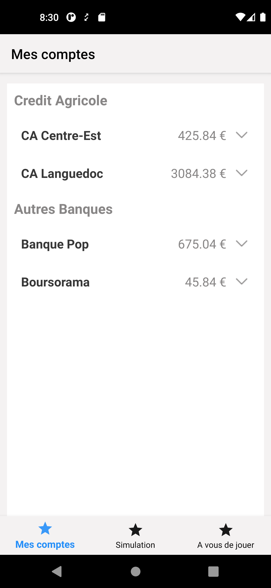
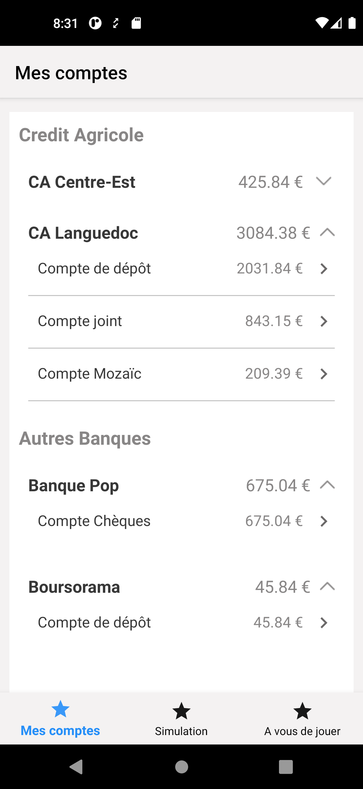
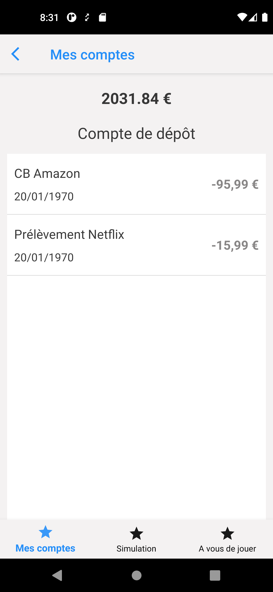

# Test Credit Agricole

## Présentation

Ceci est une petite application réalisée à partir des spécifications envoyées dans <a
href="https://drive.google.com/drive/folders/1NDcQMqCH5Wm0BQrmvY8uJWAtoUdw1Psv?usp=sharing" target="_blank">Google Drive</a>.

L'application permet de réaliser les opérations suivantes :

* Afficher une liste de banques regroupées en deux catégories : **Les banques CA** et les **Autres banques**
* Afficher la liste des comptes associés à chaque banque
* Afficher la liste des opérations de chaque compte

## Présentation

L'application a été conçue en utilisant les éléments suivants :

* Architecture MVVM;
* Hilt pour la DI
* Retrofit pour communiquer avec le serveur
* Les Coroutines
* Les LiveData et Flows
* La Navigation component

## Résultat

<div class="container" style="display: flex;">
	<div class="segImg" style="flex: 1; margin: 15px;">
    	
	</div>
	<div class="segImg" style="flex: 1; margin: 15px;">
    	
	</div>
	<div class="segImg" style="flex: 1; margin: 15px;">
    	
	</div>
</div>

## Rmarques

Par défaut, l'application appelle le serveur pour récupérer les data. J'ai néanmoins ajouté un intercepteur dans **Retrofit** qui permet de retourner une réponse mockée. 

Ceci peut être utilisé si le nombre limite de requêtes autorisé est dépassé.

Pour activer cette option il faut :

* Aller dans le fichier **app/build.gradle.kts**

* Aller dans le block **buildTypes**

* Modifier la variable ``` buildConfigField("Boolean", "USE_MOCK", "false") ``` soit dans le block **debug**, soit dans le block **release**, suivant le type de build généré.
